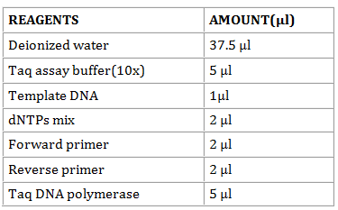
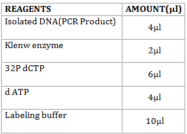
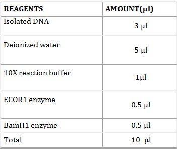

The details of the steps involved in the  Sequencing of 16S Ribosomal RNA is discussed in the following sections.
 
### Extraction of DNA
 
#### Materials Required
 
1.	Bacterial culture
2.	TE Buffer
3.	Lysozyme solution
4.	SDS (10% and 1%)
5.	Proteinase K
6.	Phenol
7.	Chloroform
8.	Isoamyl alcohol
9.	Sodium acetate
10.	Absolute ethanol
11.	Micropipettes
12.	Water bath
13.	Centrifuge
 
 
 #### Procedure:
 
1.	Centrifuge the bacterial culture at 5000 rpm for 10 minutes.
2.	After centrifugation, add 5.6ml of TE buffer into the pellet.
3.	Add 100ul of lysozyme solution into the pellet and keep it in the water bath for 1.5 hours at 370C.
4.	Again add 1000ul of 10% SDS and 2.5ul of Proteinase K to the tube with pellet solution and in water bath for 1hour at 370C.
5.	Then add 3.5 ml of phenol to the microfuge tube. Centrifuge at 1000 rpm for 15 minutes.
6.	After centrifugation, 2.5ml of phenol, 2.4ml of Chloroform and 100ul of isoamyl alcohol is added to the new tube containing the supernatant. Centrifuge at 1000 rpm for 15 minutes.
7.	After centrifugation, add 4.8ml of chloroform and 200ul of isoamyl alcohol to the new tube containing the supernatant. Centrifuge at 1000 rpm for 10 minutes.
8.	After centrifugation, add 100ul of sodium acetate and 1000ul of absolute ethanol to the new tube containing supernatant solution.
9.	Transfer the thread like DNA structures to a new sterile microfuge tube.
10.	Add 50 ul of TE buffer to the DNA solution to store it for future purposes.
 
 
### Polymerase Chain Reaction
 
#### Materials Required
 
1.	DNA solution.
2.	RNAse DNAse free water.
3.	10 X buffer.
4.	dNTP’s.
5.	Forward primer.
6.	Reverse primer.
7.	Taq polymerase.
8.	PCR machine.
 
#### Procedure:
 
1.	In a sterile 0.5-ml microfuge tube, mix in the following order.

2 	If the thermal cycler is not fitted with a heated lid, overlay the reaction mixtures with 1 drop (approx. 50 μl) of light mineral oil. Alternatively, place a bead of wax into the tube if using a hot start protocol. Place the tubes or the micro titer plate in the thermal cycler. Amplify the nucleic acids using the denaturation, annealing, and polymerization times at specified temperature.

3.	Withdraw a sample (5-10 μl) from the test reaction mixture and the four control reactions, analyze them by electrophoresis through an agarose gel, and stain the gel with ethidium bromide or SYBR Gold to visualize the DNA.

4.	A successful amplification reaction should yield a readily visible DNA fragment of the expected size. The identity of the band can be confirmed by DNA sequencing, Southern hybridization and/or restriction mapping.
 
 
### Agarose Gel Electrophoresis:
 
#### Materials Required:
 
1.	Agarose powder
2.	Ethidium bromide
3.	Electrophoresis buffer
4.	DNA samples
5.	DNA Ladders
6.	Gel casting trays
7.	Transilluminator
 
#### Procedure:
 
1.	Prepare a 50x stock solution of TAE buffer in 1000m of distilled H2O:
2.	Prepare sufficient electrophoresis buffer (usually 1x TAE ) to fill the electrophoresis tank and to cast the gel.
3.	Prepare a solution of agarose.
4.	When the molten gel has cooled, add 0.5µg/ml of ethidium bromide. Mix the gel solution thoroughly by gentle swirling.
5.	While the agarose solution is cooling, choose an appropriate comb for forming the sample slots in the gel. Pour the warm agarose solution into the mold.
6.	Allow the gel to set completely (30-45 minutes at room temperature), then pour a small amount of electrophoresis buffer on the top of the gel, and carefully remove the comb. Pour off the electrophoresis buffer. Mount the gel in the electrophoresis tank.
7.	Add just enough electrophoresis buffers to cover the gel to a depth of approx. 1mm.
8.	Mix the samples of DNA with 0.20 volumes of the desired 6x gel-loading buffer. Slowly load the sample mixture into the slots of the submerged gel using a disposable micropipette or an automatic micropipette or a drawn-out Pasteur pipette or a glass capillary tube. Load size standards into slots on both the right and left sides of the gel.
9.	Close the lid of the gel tank and attach the electrical leads so that the DNA will migrate toward the positive anode (red lead). Apply a voltage of 1-5 V/cm (measured as the distance between the positive and negative electrodes). If the electrodes are 10cm apart then run the gel at 50V. It is fine to run the gel slower than this but do not run it any faster. Above 5V/cm the agarose may heat up and begin to melt with disastrous effects on your gel's resolution. If the leads have been attached correctly, bubbles should be generated at the anode and cathode.
10.	Run the gel until the bromophenol blue and xylenecyanol FF have migrated an appropriate distance through the gel.
 
 
### Elution of DNA
 
#### Materials Required:
 
1.	Elution buffer
2.	Agarose
3.	Micropipettes
4.	Dry bath incubator
5.	Microfuge tubes
6.	Centrifuge
7.	N-Butanol
8.	Cryo box
9.	Cyclomixer
10.	Ethanol( 70% and 95%)
11.	TE buffer
12.	-20oC freezer
13.	  -70oC freezer
14.	UV transilluminator
 
 
#### Procedure:
 
1.	Visualize the low melting point agarose gel with DNA bands under a UV transilluminator and locate the desired DNA band to cut.
2.	Carefully cut around the desired DNA band using a scalpel blade.
3.	Transfer the gel piece into a microfuge tube.
4.	Add elution buffer into the microfuge tube until the level of buffer is just above the level of gel slice.
5.	Heat the gel slice at 65oC until it melts.
6.	Freeze the melted gel with DNA by placing in a -70oC freezer for10 minutes.
7.	After freezing, centrifuge for 10minutes and transfer the supernatant into a new microfuge tube.
8.	Again add half amount of elution buffer that you added in the previous step into the pellet.
9.	Heat at 65oC until the agarose melts.
10.	Freeze the melted gel with DNA by placing in a -70oC freezer for10minuts.
11.	Centrifuge the tube again for 10 minutes and transfer (pool) the supernatant into the previous tube with supernatant.
12.	Discard the tube with pellets.
13.	Add an equal volume of n-Butanol to the supernatant and mix the contents well.
14.	Vortex the tube for 15 minutes in order to remove the Ethidium bromide.
15.	Discard the upper phase of butanol and repeat the process by adding n-butanol again for one or more times.
16.	Add 2 times volume of 95% ethanol and mix thoroughly.
17.	Keep for precipitation in -70oC freezer for 30minutes to overnight.
18.	After precipitation, centrifuge for 15 minutes.
19.	Discard the supernatant into a waste beaker and add 200µl of 70% ethanol to the pellets.
20.	Centrifuge for 5minutes and discard the supernatant again.
21.	Allow the pellets to dry well.
22.	Suspend the pellets in 20µl of TE buffer. (If you want to confirm the recovered DNA, run (1µl) it on a gel.
23.	The recovered DNA can be now used for further process of cloning otherwise can stored in -20oC freezer.
 
 
### Radiolabeling Technique:
 
#### Materials Required:
 
1.	Isolated DNA (PCR Product)
2.	Klenow enzyme
3.	32P dCTP
4.	d ATP
5.	Labeling buffer
6.	Water bath
7.	Micropipettes
8.	-4oC freezer
9.	-20oC freezer
 
#### Procedure:
 
1.	In a sterile 0.5-ml microfuge tube, mix in the following order

2.	Denature the solution by keeping it in a water bath at 37oC for 4 hours and after incubation keep it in the ice cubes for 5 minutes.

3.	Transfer 30 µl of the radio labeling mixture into a spin column and keep it in spin column in -4oC freezer or in -20oC freezer.

4.	Then centrifuge it at 1000 rpm for 2 minutes. After centrifugation, keep it in the water bath 37oC for 10 minutes.

5.	After incubation, keep the spin column in -4oC freezer or in -20oC freezer.
 

### Restriction Digestion
 
#### Materials Required:
 
1.	Microcentrifuge tubes
2.	Micropipettes
3.	Centrifuge
4.	Incubator
5.	Reagents
 
 
#### Procedure:
 
1.	Transfer the following solutions in a micro centrifuge tube.

2.	Incubate the mixture at 37oC for 1 h to overnight. Keep the tubes in -4oC freezer or in -20oC freezer, after the incubation.
 
  
### Southern Blotting
 
#### Materials Required:
 
1.	Gel (subjected to agarose gel electrophoresis)
2.	Neutralizing solution
3.	Whatman filter paper
4.	Nylon membranes
5.	TE buffer
6.	Plastic wrapper
7.	Stack of paper
8.	Large glass slide
9.	Weight of about 2-3 kg
10.	Transfer buffer
11.	UV transilluminator
12.	Prehybridization buffer
13.	Hybridization buffer
14.	Hybridization oven
15.	20 µl of probe solution
16.	0.1% SDS
17.	X-ray film
18.	Autoradiography cassette
 
#### Procedure:
 
1.	Transfer the gel (subjected to agarose gel electrophoresis) into the denaturing solution and rotate it gently for 5 minutes.
2.	Discard the denaturing solution and then wash it in neutralizing solution for 5 minutes.
3.	Set up the blot transfer as follows; be careful to avoid the formation of air bubbles.
4.	Transfer the gel containing the DNA into a wet Whatman filter paper. The whole set up is carried in a reservoir which is filled with transfer buffer.
5.	Place nylon membranes over the gel. Place Whatman filter paper over the nylon membrane.
6.	Flood the paper with TE buffer wit out forming any air bubbles.
7.	Cover the reservoir with plastic wrapper.
8.	Place a stack of paper over the gel and press it gently.
9.	A large glass slide and an additional weight of about 2-3 kg are placed over the stack of paper to keep the blot in place.
10.	Keep it undisturbed overnight.
11.	After the incubation, carefully remove the glass slide, weight and stacks of paper.
12.	Take the nylon membrane carefully and keep it in the tray containing 6X transfer buffer and place the nylon membrane in the UV transilluminator. After that keep the membrane in a white paper.
13.	Add the prehybridization buffer into the hybridization tube and keep the nylon membrane in the hybridization tube.
14.	Keep the hybridization tube in the hybridization oven and incubate at 42oC for 2 to 4 hours.
15.	After that discard the prehybridization buffer and add hybridization buffer. Also add 20 µl of probe into the hybridization tube.
16.	Keep the hybridization tube in the hybridization oven and incubate at 42oC for 2 to 4 hours.
17.	After that discard the hybridization buffer and add few ml of 0.1% SDS into the hybridization tube.
18.	Incubate at 52oC for 30 minutes.
19.	Carefully take the nylon membrane from the hybridization tube.
20.	Place it on the autoradiography cassette. Observe the result.
21.	
 
#### Result:
 
Observe the band corresponding to the 16S Ribosomal RNA sequence of the test organism.
 

